# Linux C 编程及进程创建
## 实验目的
### 一、	Linux C 编程
1. 熟练使用vi中的常见操作，并且熟悉vi的3种模式；
2. 掌握gcc编译命令及gdb的调试命令；通过对有问题程序的跟踪调试，进一步提高发现问题和解决问题的能力；

### 二、	进程创建和控制
1. 加深对进程概念的理解，明确进程和程序的区别；
2. 进一步认识并发执行的实质

## 实验内容
  实验使用 vi 进行编辑，并且使用 gdb 进行调试，实现程序的调试。实验所用的 Linux 操作系统为 Ubuntu 20.04 LTS，运行在 Windows Subsystem for Linux 上。

### 一、	Linux C 编程
#### 1.	编辑程序
  首先执行以下命令，创建一个新的文件，文件名为`hello.c`：

```shell
$ vi hello.c
```

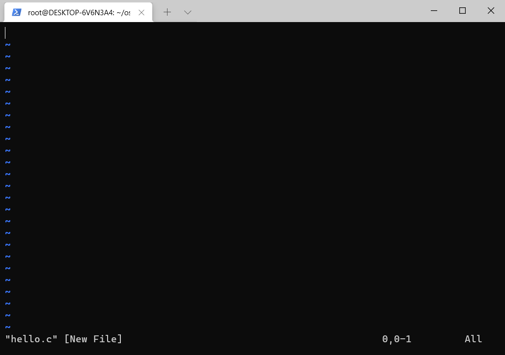

  此时进入到 vi 编辑器，左下角显示了当前编辑的文件名，`[New File]`表示这是新创建的文件。

  按下键上的`i`键后，进入到 vi 编辑器的编辑模式，即可在文件中输入如下内容：

```c
#include <stdio.h>
int main()
{
    printf("Hello World!\n");
}
```

  输入好后退出 vi，退出方法为，先按下键盘上的`ESC`键，然后执行：

```shell
$ :wq
```

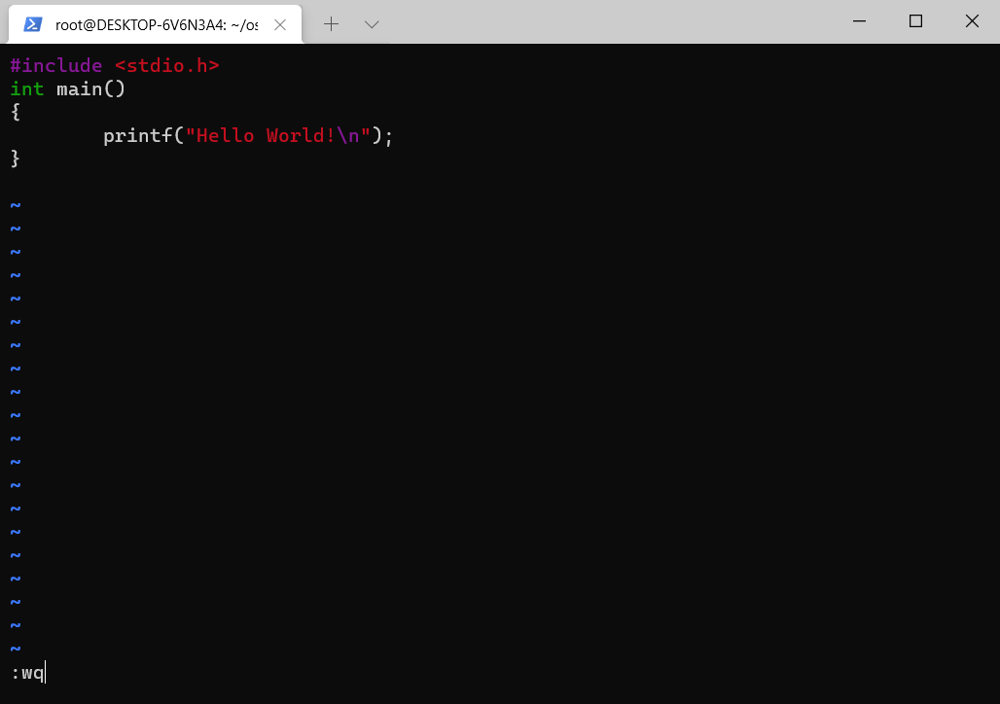

  然后执行以下命令，编译文件：

```shell
$ gcc hello.c -o hello
```
其中`-o file`表示将编译后的文件命名为`file`。

  没有错误信息，则表示编译成功，可以执行编译后的文件：

```shell
$ ./hello
```

执行后会输出：

```shell
Hello World!
```

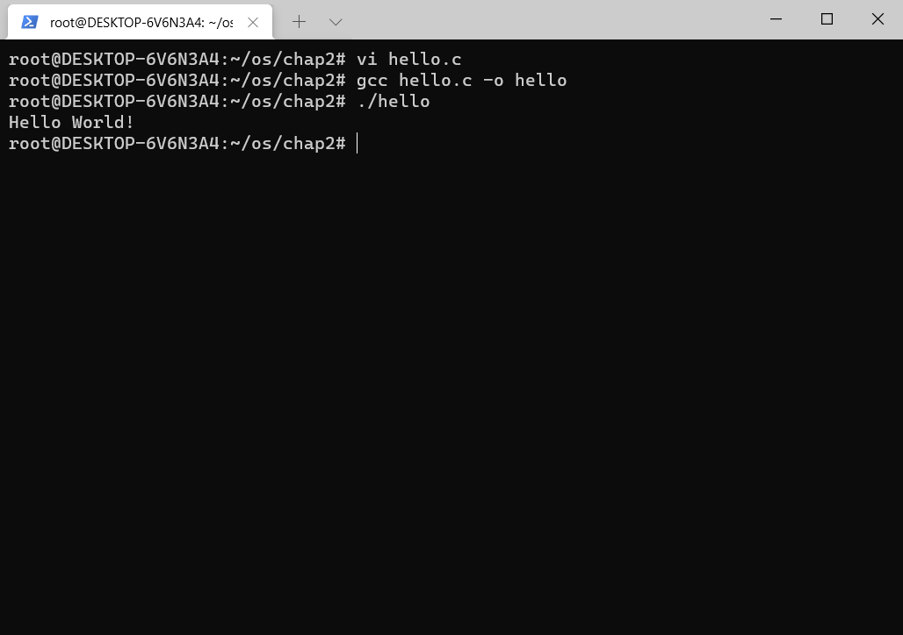

  执行结果正确，本次实验成功。

#### 2. 使用 GDB 调试器进行调试
  采用一样的方法，创建一个新的文件，文件名为`file.c`，文件的内容如下：

```c
#include <stdio.h>
static char buff[256];
static char *string;
int main()
{
    printf("input: ");
    gets(string);
    printf("\noutput: %s \n", string);
}
```

  在 vi 中输入`set nu`，即可将行号显示出来，如下图所示：

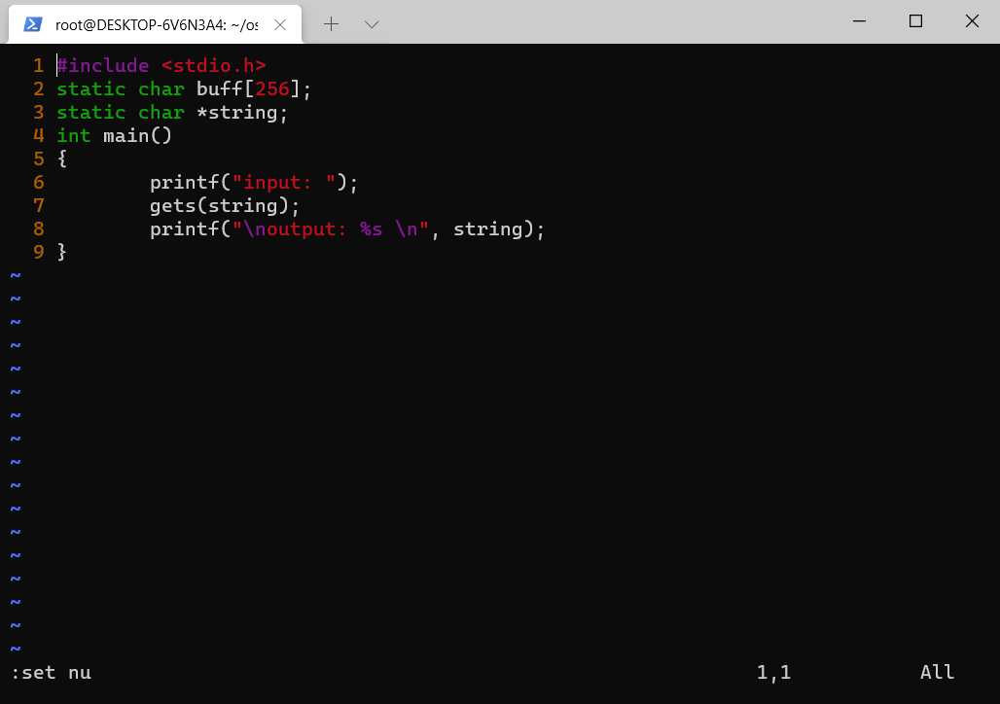

  保存文件，并且退出 vi，然后执行以下命令编译文件：

```shell
$ gcc file.c -g -o file
```

其中，`-g`表示使用 GDB 调试器。编译时出现了对`gets`函数的警告信息，忽略之，实际上已编译成功。

  执行编译后的文件，并且输入字符串`hello world`，结果如下：

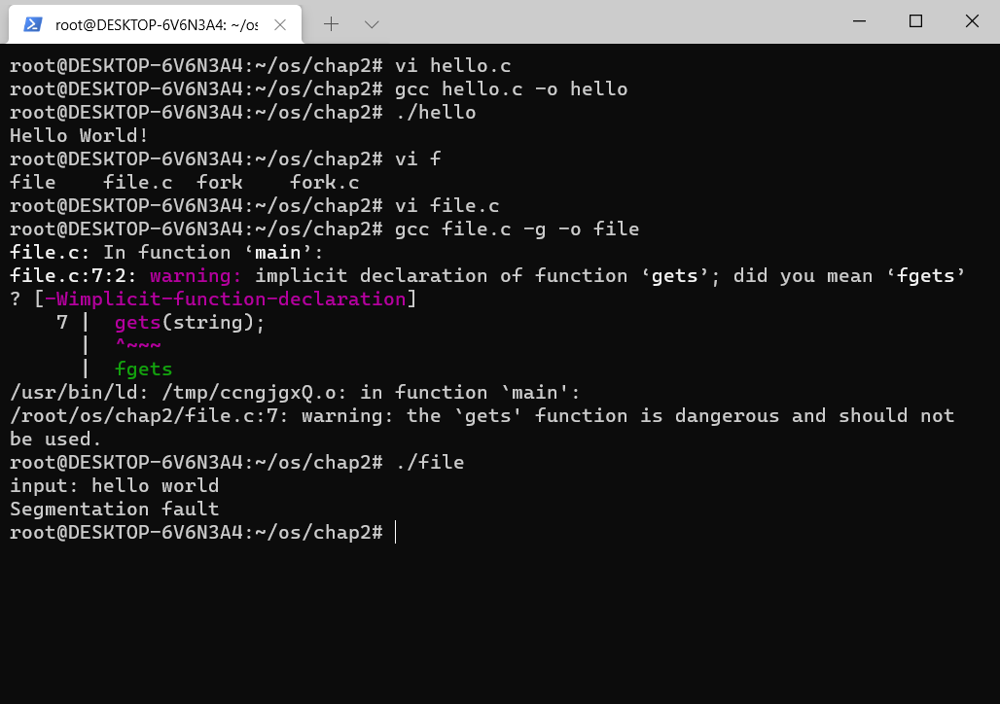

  可以看到出现了提示`Segmentation fault`，现在使用 GDB 对其进行调试。 执行以下命令：

```shell
$ gdb file
```

此时装入了`file`，输入`run`并回车即可执行装入的file文件，并可使用`where`命令查看程序出错的位置。

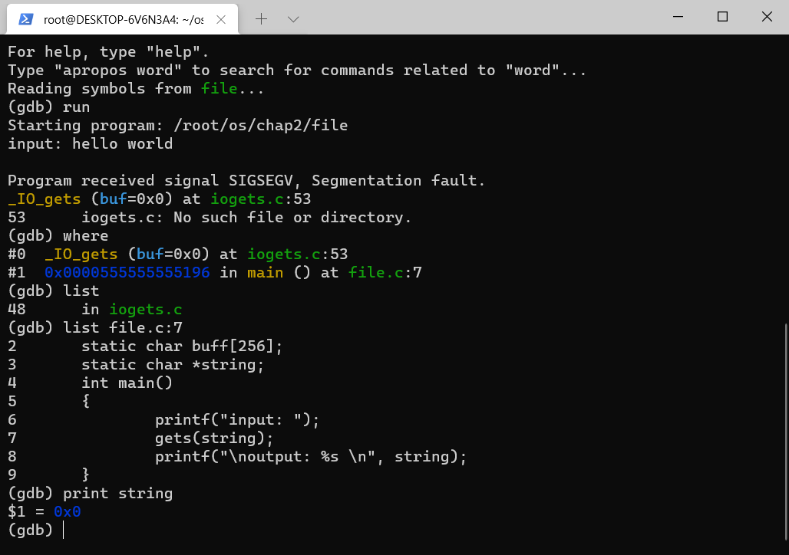

  定位到问题是`string`变量，使用`print`可知其值不正确

```shell
(gdb) print string
$1 = 0x0
```

  执行

```shell
(gdb) break 7
```

在第7行处打断点，然后重新运行

```shell
(gdb) run
The program being debugged has been started already.
Start it from the beginning? (y or n) y
Starting program: /root/os/chap2/file

Breakpoint 1, main () at file.c:7
7               gets(string);
```

  此时执行

```shell
(gdb) set variable string=buff
```

以将`string`的值设置为`buff`，一个字符串指针。然后输入`c`并回车继续执行程序下面的内容

```shell
(gdb) c
Continuing.
input: hello world

output: hello world
[Inferior 1 (process 549) exited normally]
```

  可以看到程序正常执行并退出了。输入`q`并回车可以退出 GDB 调试。

  运行截图如下：

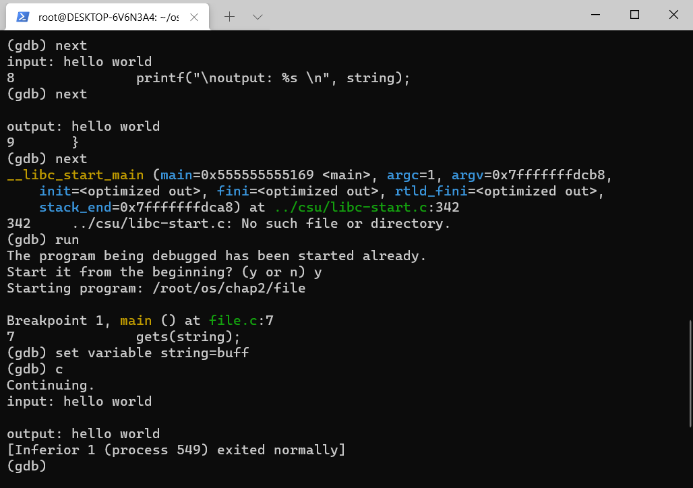

### 二、使用 Linux C 编程打印水仙花数
  创建一个新的文件，文件名为`ppdi.c`，文件的内容如下：

```c
#include <stdio.h>

int main() {
    int a, b, c, n;
    printf("The result is: \n");
    for (n = 100; n < 1000; n++)
    {
        a = n / 100;
        b = (n - a*100) / 10;
        c = n % 10;
        if (n == a*a*a + b*b*b + c*c*c) {
            printf("%d\n", n);
        }
    }
    return 0;
}
```

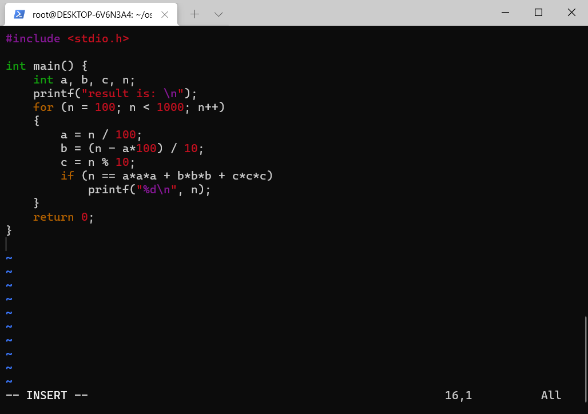

  保存并退出，执行

```shell
$ gcc ppdi.c -g -o ppdi
$ gdb ppdi
(gdb) run
```

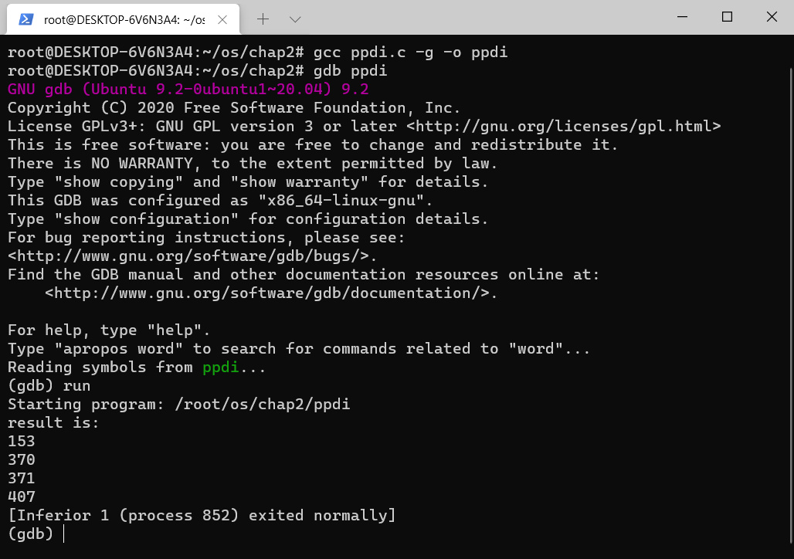

  程序成功正常输出，输入

```shell
(gdb) q
```

退出调试。

### 三、进程创建和控制
  创建一个新的文件，文件名为`ppdi.c`，文件的内容如下：

```c
#include <unistd.h>
#include <stdio.h>

int main() {
    pid_t fpid; //fpid表示fork函数返回的值
    int count = 0;
    fpid = fork();
    if (fpid < 0) {
        printf("error in fork!");
    } else if (fpid == 0) {
        printf("\nfpid: %d\n", fpid);
        printf("i am the child process, my process id is %d\n", getpid());
        printf("我是爹的儿子\n");
        count++;
    } else {
        printf("\nfpid: %d\n", fpid);
        printf("i am the parent process, my process id is %d\n", getpid());
        printf("我是孩子他爹\n");
        count++;
    }
    printf("统计结果是: %d\n", count);
    printf("--------\n");
    return 0;
}
```

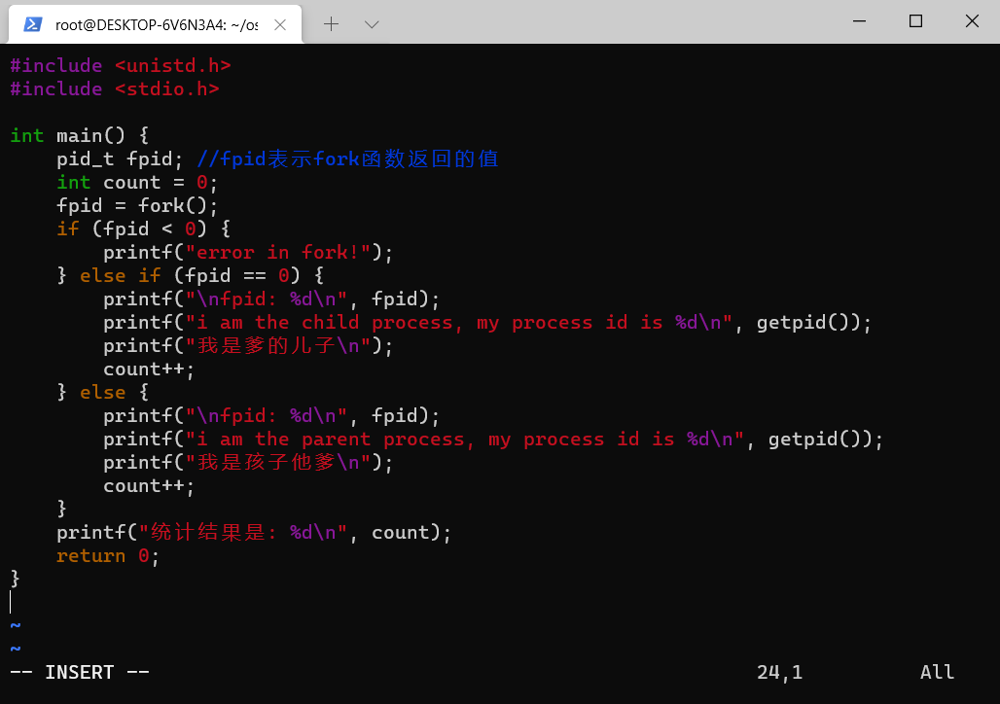

  保存并退出，执行

```shell
$ gcc fork.c -o fork
$ ./fork
$ ./fork
```

`./fork` 运行了两次，两次的运行结果如下：

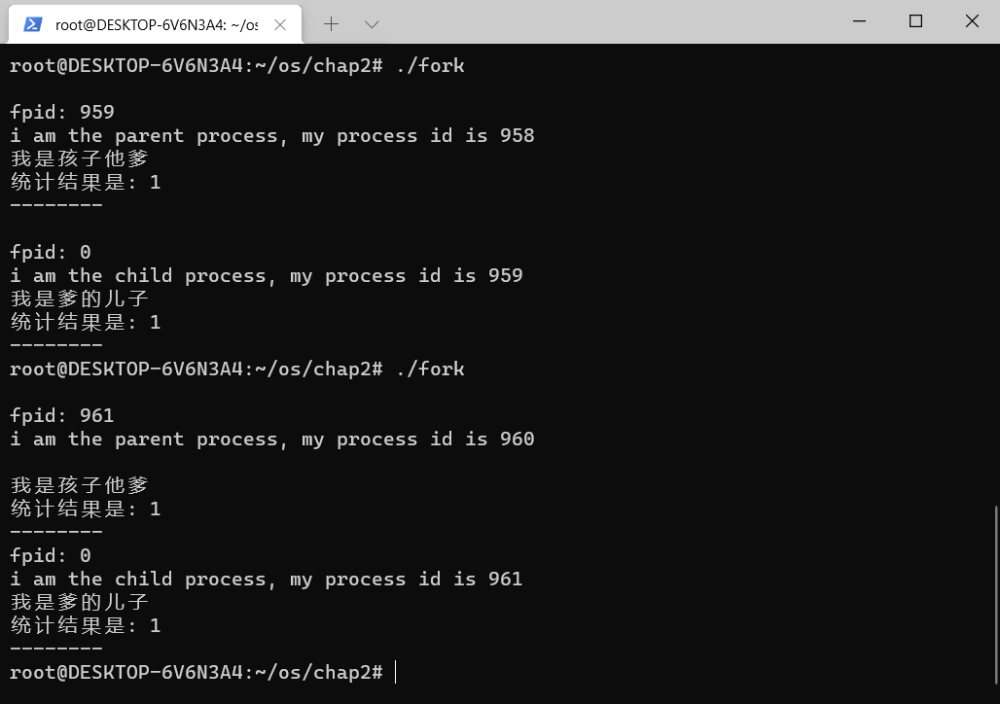

#### 对运行结果的分析
  在语句 `fpid=fork()` 之前，只有一个进程在执行这段代码，但在这条语句之后，就会有两个进程在执行了，这两个进程是等价的，将要执行的下一条语句都是 `if (fpid < 0) {...}`

  可以注意到，两个进程的 `fpid` 是不同的，且两次运行的结果也不一样，这与 `fork()` 函数的特性有关。调用 `fork()` 的一个特性为，它仅仅被调用一次，却能够返回两次，它可能有三种不同的返回值：

1. 在父进程中，`fork()` 返回新创建子进程的`进程ID`；
2. 在子进程中，`fork()` 返回 `0`；
3. 如果出现错误，`fork()` 返回一个 `负值`；

  在`fork()` 函数执行完毕后，如果创建新进程成功，则出现两个进程，一个是子进程，一个是父进程。在子进程中，`fork()` 函数返回 `0`；在父进程中，`fork()` 返回新创建子进程的 `进程ID`。这样一来，我们可以通过 `fork()` 返回的值来判断当前进程是子进程还是父进程。也即，与上述代码中的

```
if (fpid < 0) {
    // 创建进程失败
} else if (fpid == 0) {
    // 子进程
} else {
    // 父进程
}
```

相对应。
