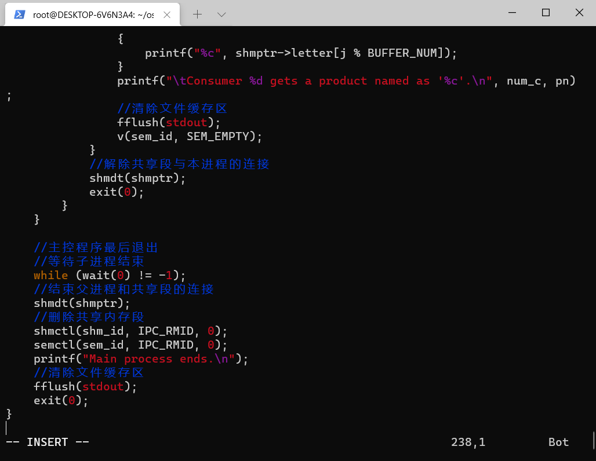
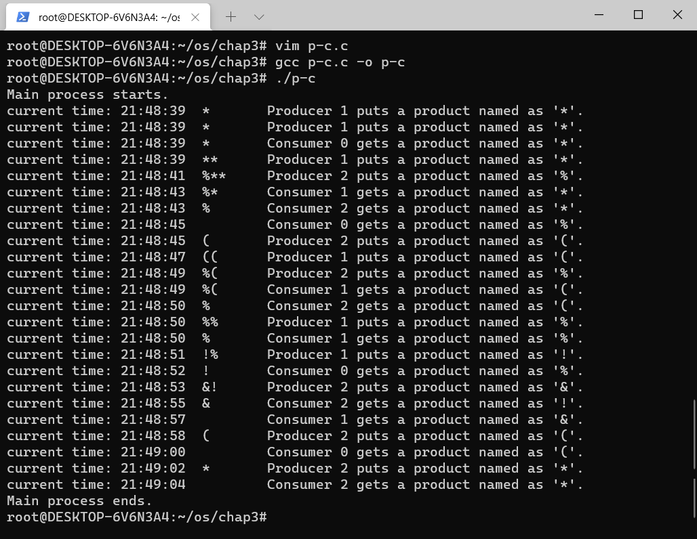
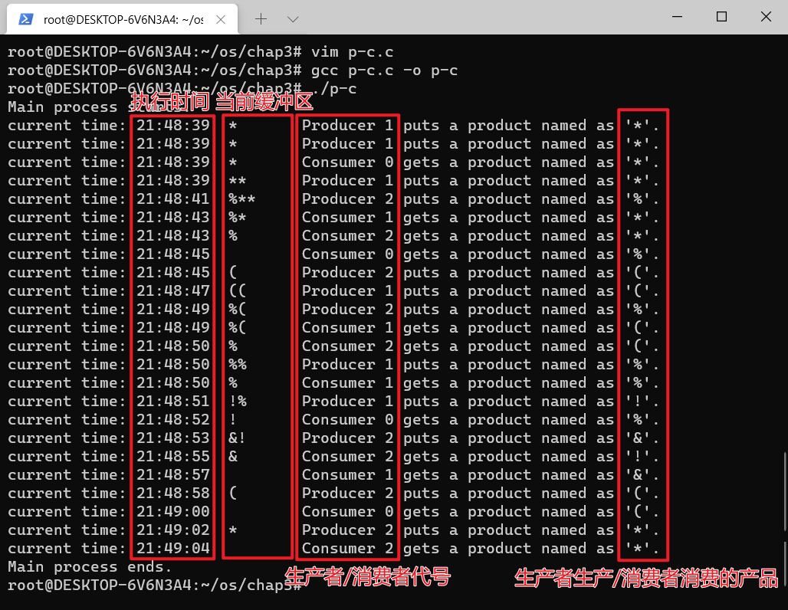
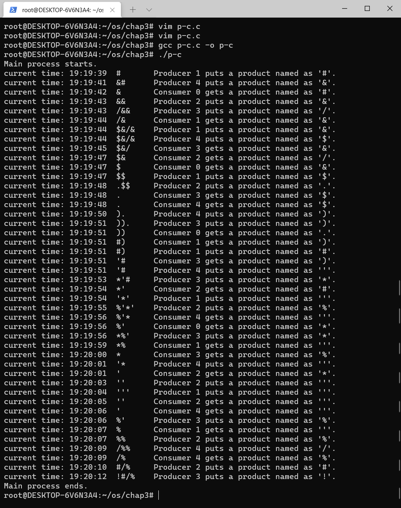

# Linux 下的进程同步实验
## 实验目的
1. 理解进程同步的方法，学会运用进程同步的方法解决实际问题；

2. 了解 Linux 系统下信号量的使用方法。

## 实验内容
1. 在 Linux 环境下编译运行以下代码并截图

2. 对代码添加注释（关键步骤即可）

3. 分析程序的输出，解释输出结果

4. 修改消费者数量、生产者数量、缓冲区个数，并编译运行，保存截图

## 实验步骤
### 实验简述
  该代码是一个模拟`生产者-消费者问题`的程序，通过模拟进程中的共享内存的实现，利用信号量同步或互斥访问共享存储区。

  在本代码中，使用随机选择的字符作为生产者生产、消费者消费到的“产品”。模拟的过程为，每个生产者随机等待一段时间，向缓冲区添加一个字符，若缓冲区已满，等待消费者取走字符后再添加。与此同时，每个消费者随机等待一段时间，从缓冲区读取字符；若缓冲区为空，等待生产者添加字符后再读取。另外，消费者消费时，按先生产的商品先消费原则进行消费。

  为了体现程序的执行过程，代码还实现了打印了程序的执行步骤。这其中的内容包括：执行生产/消费时的时间、当前缓冲区的内容、生产者/消费者代号、生产者本次写入，或者消费者本次取走缓冲区的字符。

### 编译运行

  代码及注释如下：

```c
//生产者和消费者问题源码
//定义头文件
#include <stdio.h>
#include <stdlib.h>
#include <time.h>
#include <unistd.h>
#include <sys/ipc.h>
#include <sys/shm.h>
#include <sys/sem.h>
#include <sys/types.h>
#include <sys/wait.h>

//宏定义生产者个数， 2个
#define PRODUCER 2
//宏定义消费者个数， 3个
#define CUSTOMER 3
//宏定义写缓冲次数， 6次
#define WRITE_NUM 6
//宏定义读缓冲次数， 4次
#define READ_NUM 4


#define SEM_ALL_KEY 1342
#define SEM_EMPTY 0
#define SEM_FULL 1

//宏定义缓冲区大小
#define BUF_LENGTH (sizeof(struct container_buffer))
//宏定义缓冲区个数 3个
#define BUFFER_NUM 3 
//宏定义创建和访问标志
#define SHM_MODE 0600


//缓冲区结构（循环队列）
//定义共享缓冲区结构
struct container_buffer 
{
    char letter[BUFFER_NUM];
    int head;
    int tail;
    //判断缓冲区是否为空的标志
    int is_empty; 
};

//得到6以内的一个随机数，产生延迟时间
int random_num() {
    int t;
    srand((unsigned) (getpid() + time(NULL)));
    t = rand() % 6;
    return t;
}

//P操作，获得使用权
void p(int sem_id, int sem_num) {
    struct sembuf sem_buff;
    sem_buff.sem_num = sem_num;
    sem_buff.sem_op = -1;
    sem_buff.sem_flg = 0;
    semop(sem_id, &sem_buff, 1);
}

//得到一个随机字符,模拟产品名字
char random_letter() {
    char a;
    srand((unsigned) (getpid() + time(NULL)));
    a = (char) ((char) (rand() % 15) + '!');
    return a;
}

//V操作，释放使用权
void v(int sem_id, int sem_num) {
    struct sembuf sem_buff;
    sem_buff.sem_num = sem_num;
    sem_buff.sem_op = 1;
    sem_buff.sem_flg = 0;
    semop(sem_id, &sem_buff, 1);
}

//主函数
int main(int argc, char *argv[]) {
    //定义共享内存段标识变量shm_id，定义信号量标识变量sem_id
    int shm_id, sem_id;
    //定义生产者和消费者的个数变量，初始化为0
    int num_p = 0, num_c = 0, i, j;
    //指向缓冲区结构的指针
    struct container_buffer *shmptr;
    //随机字符，代表产品
    char pn; 
    //时间变量
    time_t now;
    //进程pid变量
    pid_t pid_p, pid_c; 
    printf("Main process starts.\n");
    //创建两个信号量, empty, full
    sem_id = semget(SEM_ALL_KEY, 2, IPC_CREAT | 0660);
    //索引为SEM_EMPTY的信号量值为3
    semctl(sem_id, SEM_EMPTY, SETVAL, BUFFER_NUM);
    //索引为SEM_FULL的信号量值为0
    semctl(sem_id, SEM_FULL, SETVAL, 0);

    //申请一个共享主存段,大小为缓冲区大小
    if ((shm_id = shmget(IPC_PRIVATE, BUF_LENGTH, SHM_MODE)) < 0)
    {
        //失败退出
        exit(1); 
    }
    //将共享段与进程相连
    if ((shmptr = shmat(shm_id, 0, 0)) == (void *) -1)
    {
        //失败退出
        exit(1); 
    }
    //初始化缓冲区
    shmptr->head = 0;         
    shmptr->tail = 0;
    shmptr->is_empty = 1;

    //循环创建2个生产者
    while ((num_p++) < PRODUCER) 
    {
        //创建一个进程
        if ((pid_p = fork()) < 0)  
        {
            //失败退出
            exit(1); 
        }
        //如果是子进程，开始创建生产者
        if (pid_p == 0) {
            //将共享段与本进程相连
            if ((shmptr = shmat(shm_id, 0, 0)) == (void *) -1) 
            {
                exit(1); //失败退出
            }
            //循环尝试在缓冲区内放入数据为WRITE_NUM次
            for (i = 0; i < WRITE_NUM; i++) 
            {
                //p操作，申请使用权,p(empty)
                p(sem_id, SEM_EMPTY);
                //随机等待一段时间
                sleep(random_num());
                //在缓冲队列里面放入一个产品
                shmptr->letter[shmptr->tail] = pn = random_letter();
                shmptr->tail = (shmptr->tail + 1) % BUFFER_NUM;
                //更新缓冲区状态为满
                shmptr->is_empty = 0;
                //取得系统时间
                now = time(NULL);
                printf("current time: %02d:%02d:%02d\t",
                       localtime(&now)->tm_hour, localtime(&now)->tm_min,
                       localtime(&now)->tm_sec);
                //输出缓冲区状态
                for (j = (shmptr->tail - 1 >= shmptr->head) ? (shmptr->tail - 1) : (shmptr->tail - 1 + BUFFER_NUM);
                         !(shmptr->is_empty) && j >= shmptr->head;
                         j--)
                {
                    printf("%c", shmptr->letter[j % BUFFER_NUM]);
                }
                //输出动作序列
                printf("\tProducer %d puts a product named as '%c'.\n", num_p, pn);
                //清除文件缓存区
                fflush(stdout);                 
                //释放对文件的使用权，V(full)
                v(sem_id, SEM_FULL);  
            }
            //将共享段与进程之间解除链接
            shmdt(shmptr);    
            //子进程终止
            exit(0);           
        }
    }

    //循环创建COSTOMER个生产者
    for (; num_c < CUSTOMER; num_c++)
    {
        //创建一个子进程
        if ((pid_c = fork()) < 0)  
        {
            printf("Error on fork.\n");
            //失败退出
            exit(1);   
        }
        //如果是子进程，开始创建消费者
        if (pid_c == 0) {
            //将共享段与本进程相连
            if ((shmptr = shmat(shm_id, 0, 0)) == (void *) -1) 
            {
                printf("Error on shmat.\n");
                //失败退出
                exit(1); 
            }
            //循环读READ_NUM次
            for (i = 0; i < READ_NUM; i++)  
            {
                //p操作，p(full),实现同步
                p(sem_id, SEM_FULL);
                //随机等待一段时间
                sleep(random_num()); 
                pn = shmptr->letter[shmptr->head];
                //得到读取的产品标示字符
                shmptr->head = (shmptr->head + 1) % BUFFER_NUM;
                //更新缓冲区产品状态
                shmptr->is_empty = (shmptr->head == shmptr->tail);
                //得到系统时间
                now = time(NULL);
                printf("current time: %02d:%02d:%02d\t",
                       localtime(&now)->tm_hour, localtime(&now)->tm_min, localtime(&now)->tm_sec);
                // 输出缓冲区状态
                for (j = (shmptr->tail - 1 >= shmptr->head) ? (shmptr->tail - 1) : (shmptr->tail - 1 + BUFFER_NUM);
                !(shmptr->is_empty) && j >= shmptr->head; j--)  
                {
                    printf("%c", shmptr->letter[j % BUFFER_NUM]);
                }
                printf("\tConsumer %d gets a product named as '%c'.\n", num_c, pn);
                //清除文件缓存区
                fflush(stdout);
                v(sem_id, SEM_EMPTY);
            }
            //解除共享段与本进程的连接
            shmdt(shmptr);
            exit(0);
        }
    }

    //主控程序最后退出
    //等待子进程结束
    while (wait(0) != -1);
    //结束父进程和共享段的连接
    shmdt(shmptr);
    //删除共享内存段
    shmctl(shm_id, IPC_RMID, 0);
    semctl(sem_id, IPC_RMID, 0);
    printf("Main process ends.\n");
    //清除文件缓存区
    fflush(stdout); 
    exit(0);
}
```



  将以上代码保存为文件，文件名为 `p-c.c` ，使用以下命令编译并运行：

```shell
$ gcc p-c.c -o p-c
$ ./p-c
```
运行的截图如下：



### 对代码的分析

1. 缓冲区采用循环队列表示，利用头、尾指针来存放、读取数据，以及判断队列是否为空。缓冲区中数组个数为 3

2. 利用随机函数 `rand()` 得到一个随机字符，作为生产者每次生产的数据，存放到缓冲区中

3. 使用 `shmget()` 系统调用实现共享主存段的创建， `shmget()` 返回共享内存区的 ID 。对于已经申请到的共享段，进程需把它附加到自己的虚拟空间中，才能对其进行读写。

4. 信号量的创建采用 `semget()` 函数，同时创建信号量的数量。在信号量创建后，调用 `semctl()` 对信号量进行初始化，例如在代码中，建立了两个信号量 `SEM_EMPTY` 、 `SEM_FULL` ，初始化时设置 `SEM_EMPTY` 为 `0` ， `SEM_FULL` 为 `1` 。使用操作信号的函数 `semop()` 做排除式操作，使用这个函数防止对共享内存的同时操作。对共享内存操作完毕后采用 `shmctl()` 函数删除共享内存段

5. 使用循环，创建2个生产者以及2个消费者，采用函数 `fork()` 创建一个新的进程

6. 一个进程的一次操作完成后，采用函数 `fflush()` 清除缓冲区

7. 程序最后使用 `semctl()` 函数释放内存，删除共享内存段

### 对输出结果的分析

  在进程运行的整个过程中，生产者共有 2 个，每一个生产者随机进行 6 次生产操作；消费者有3个，每一个消费者随机进行 4 次消费操作，共有 2×6+3×4=24 次进程操作。



  在上面的截图可以看到，初始缓冲区为空，按照先生产先消费的顺序，生产者进程向缓冲区中写入字符，消费者进程从缓冲区中读取字符；缓冲区存满之后，生产者无法继续写入，只有等待消费者读取之后才可以继续写入（根据执行生产/消费时的时间可知）；程序运行到最后，缓冲区的内容为空，程序退出。

  由此可见，程序实现了生产者进程与消费者对于缓冲区的互斥操作，与预期结果一致。

### 修改程序，编译运行

  修改生产者数量为 4 ，消费者数量为 5 ，缓冲区个数为 4 ，其余不改动：

```c
......
#define PRODUCER 4
#define CUSTOMER 5
#define BUFFER_NUM 4
......
```

编译并运行，结果如下图所示：



与预期结果一致。
