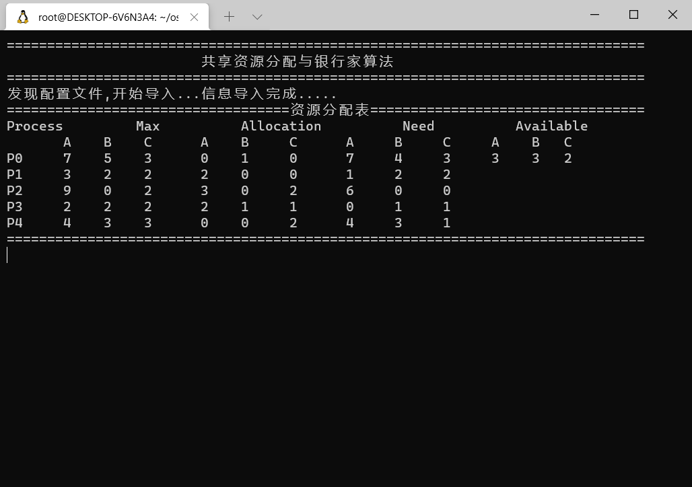

# Linux 下避免死锁银行家算法实验
## 实验目的
1. 进一步理解利用银行家算法避免死锁的问题；

2. 理解和掌握安全序列、安全性算法。

## 实验内容
1. 在 Linux 环境下编译运行以下代码并截图

2. 对代码添加注释（关键步骤即可）

3. 分析程序的输出，解释输出结果（关键输出即可）

4. 修改资源结构体的数目、进程数量、配置文件，分析产生的结果

## 实验步骤
### 实验简述
  顾名思义，银行家算法的就是把计算机系统比喻为银行，进程比喻为来贷款的人。要发放贷款最基本的要求是银行金库中还有钱，并且贷款的人有能力还款，这对应了计算机系统中的剩余资源和进程申请资源时不能超过进程需要的最大资源。核心的要求是银行在发放了贷款之后，能通过某种还款顺序保证不出现坏账，对应计算机系统中就是进程能够以某种安全序列完成任务。

  为实现银行家算法，每个新进程在进入系统时它必须申明在运行过程中，可能需要的每种资源类型的最大单元数目，其数目不应超过系统所拥有的资源总量。当某一个进程请求时，系统会自动判断请求量是否小于进程最大所需，同时判断请求量是否小于当前系统资源剩余量。若两项均满足，则系统预先分配资源并执行安全性检查算法。如果通过安全性检验，那么分配成功，如果不通过，则认为该分配序列不安全，不给予分配。

  安全性检查算法用于检查系统进行资源分配后是否安全，若安全系统才可以执行此次分配；若不安全，则系统不执行此次分配。安全性检查算法原理为：在系统预先分配资源后，算法从现有进程列表寻找出一个可执行的进程进行执行，执行完成后回收进程占用资源；进而寻找下一个可执行进程。当进程需求量大于系统可分配量时，进程无法执行。当所有进程均可执行，则产生一个安全执行序列，系统资源分配成功。若进程无法全部执行，即无法找到一条安全序列，则说明系统在分配资源后会不安全，所以此次分配失败。

### 数据结构
- 名为`RES`的结构体：

    ```c
    typedef struct {
        int A;
        int B;
        int C;
    } RES;
    ```
    用于指示三类资源`{A, B, C}`

- 系统中所有进程数量`PNUMBER`：
    ```c
    #define PNUMBER 5
    ```

- 可利用资源向量`Availble`：

    ```c
    RES Available = {0, 0, 0};
    ```
    类型为结构体`RES`。其中的每一个值依次代表对应的可用资源数目。若`Available.J=K`，则表示系统中现有`J`类资源`K`个。

- 最大需求矩阵`Max`：

    ```c
    RES Max[PNUMBER];
    ```
    类型是大小为`PNUMBER`的结构体`RES`数组。定义了系统中`PNUMBER`个进程中的每一个进程对各类资源的最大需求。`Max[i].J=K`，则表示进程`i`需要`J`类资源最大数目为`K`个。

- 分配矩阵`Allocation`：

    ```c
    RES Allocation[PNUMBER];
    ```
    类型是大小为`PNUMBER`的结构体`RES`数组。定义了系统中每一类资源当前已分配给每个进程的资源数。`Allocation[i].J=K`，则表示进程`i`当前已分配的`J`类资源的数目为`K`。

- 需求矩阵`Need`：

    ```c
    RES Need[PNUMBER];
    ```
    类型是大小为`PNUMBER`的结构体`RES`数组。表示每个进程尚需的各类资源数，`Need[i].J=K`，则表示进程`i`还需要`J`类资源数目为`K`个。

### 银行家算法描述
  设`Request[i]`是进程`Pi`的请求矢量，如果`Request[i].J=K`，表示进程`Pi`需要`J`类资源`K`个。当`Pi`发出资源请求后，系统按下述步骤进行检测：

1. 如果`Request[i].J ≤Need[i].j`，便转向`步骤2`，否则认为出错，因为它所需的资源数超过了它所宣布的最大值

2. 如果`Request[i].J ≤Available[i].j`，便转向`步骤3`，否则`Pi`须等待，因为尚无足够资源，

3. 系统试探着把资源分配给进程`Pi`，并修改下面数据结构中的数值：

    ```c
    Available.J = Availabe.J - Request[i].J
    Allocation[i].J = Allocation[i].J + Request[i].J
    Need[i].J = Need[i].J - Request[i].J
    ```

4. 系统执行安全性算法，检查此次资源分配后，系统是否处于安全状态。若安全，才正式将资源分配给进程`Pi`，以完成本次分配；否则，此次试分配作废，进程`Pi`等待。

### 安全性算法描述
1. 设置两个矩阵

    工作矩阵`Work`: 它表示系统可提供给进程继续运行所需的各类资源数目，它的类型为结构体`RES`，在执行安全算法开始时，`Work=Available`;

    `Finish`: 它表示系统是否有足够的资源分配给进程，使之运行完成。开始时`Finish[i]=false`；当有足够资源分配给进程`Pi`时，再令`Finish[i]=true`;

2. 从进程集合中找到一个能满足下述条件的进程：

    ```c
    Finish[i] = false;
    Need[i].J = Work.J;
    ```
    若找到，执行下一个步骤；否则，执行步骤4。

3. 当进程`Pi`获得资源后，可顺利执行，直至完成，并释放分配给它的资源

    ```c
    Work.J = Work.J + Allocation[i].J;
    Finish[i] = true;
    ```
    然后执行步骤2

4. 如果所有进程的`Finish[i]=true`满足，则表示系统处于安全状态；否则，系统处于不安全状态

### 编译运行
  根据实验指导中的代码，添加注释，修改增加中文提示语，整理如下：

```c
#include <stdio.h>
#include <stdlib.h>

typedef struct {
    int A;
    int B;
    int C;
} RES;

typedef int bool;
#define false 0
#define true  1

//系统中所有进程数量
#define PNUMBER 5

//最大需求矩阵
RES Max[PNUMBER];

//已分配资源数矩阵
RES Allocation[PNUMBER];

//需求矩阵
RES Need[PNUMBER];

//可用资源向量
RES Available = {0, 0, 0};

//安全序列
int safe[PNUMBER];

void setConfig() {
    int i;
    printf("================开始手动配置资源==================\n");
    //可分配资源
    printf("输入A,B,C的可分配资源数量 Available：");
    scanf("%d%d%d", &Available.A, &Available.B, &Available.C);
    //最大需求矩阵 Max
    printf("下面输入最大需求矩阵 Max\n");
    for (i = 0; i < PNUMBER; i++) {
        printf("输入P%d对A,B,C资源的需求：", i);
        scanf("%d%d%d", &Max[i].A, &Max[i].B, &Max[i].C);
    }
    //已分配矩阵 Allocation
    printf("下面输入已分配矩阵 Allocation\n");
    for (i = 0; i < PNUMBER; i++) {
        printf("输入P%d对A,B,C已获得分配的资源：", i);
        scanf("%d%d%d", &Allocation[i].A, &Allocation[i].B, &Allocation[i].C);
    }
    //需求矩阵Need
    printf("下面输入需求矩阵 Need\n");
    for (i = 0; i < PNUMBER; i++) {
        printf("输入P%d对A,B,C的需求资源：", i);
        scanf("%d%d%d", &Need[i].A, &Need[i].B, &Need[i].C);
    }
    printf("================结束配置资源==================\n");
}

void loadConfig() {
    FILE *fp1;
    if ((fp1 = fopen("config.txt", "r")) == NULL) {
        printf("没有发现配置文件,请手动输入!!!\n");
        setConfig();
    } else {
        int i;
        printf("发现配置文件,开始导入...");
        //可分配资源
        fscanf(fp1, "%d%d%d", &Available.A, &Available.B, &Available.C);
        //最大需求矩阵MAX
        for (i = 0; i < PNUMBER; i++) {
            fscanf(fp1, "%d%d%d", &Max[i].A, &Max[i].B, &Max[i].C);
        }
        //已分配矩阵Alloc
        for (i = 0; i < PNUMBER; i++) {
            fscanf(fp1, "%d%d%d", &Allocation[i].A, &Allocation[i].B, &Allocation[i].C);
        }
        //需求矩阵
        for (i = 0; i < PNUMBER; i++) {
            fscanf(fp1, "%d%d%d", &Need[i].A, &Need[i].B, &Need[i].C);
        }
        printf("信息导入完成.....\n");
    }
}

//试探分配
void ProbeAlloc(int process, RES *res) {
    Available.A -= res->A;
    Available.B -= res->B;
    Available.C -= res->C;

    Allocation[process].A += res->A;
    Allocation[process].B += res->B;
    Allocation[process].C += res->C;

    Need[process].A -= res->A;
    Need[process].B -= res->B;
    Need[process].C -= res->C;
}

//若试探分配后进入不安全状态，将分配回滚
void RollBack(int process, RES *res) {
    Available.A += res->A;
    Available.B += res->B;
    Available.C += res->C;

    Allocation[process].A -= res->A;
    Allocation[process].B -= res->B;
    Allocation[process].C -= res->C;

    Need[process].A += res->A;
    Need[process].B += res->B;
    Need[process].C += res->C;
}

//安全性检查
bool SafeCheck() {
    RES Work = Available;
    bool Finish[PNUMBER] = {false, false, false};
    int i;
    int j = 0;

    for (i = 0; i < PNUMBER; i++) {
        //是否已检查过
        if (Finish[i] == false) {
            //是否有足够的资源分配给该进程
            if (Need[i].A <= Work.A && Need[i].B <= Work.B && Need[i].C <= Work.C) {
                //有则使其执行完成，并将已分配给该进程的资源全部回收
                Work.A += Allocation[i].A;
                Work.B += Allocation[i].B;
                Work.C += Allocation[i].C;
                Finish[i] = true;
                safe[j++] = i;
                //重新进行遍历
                i = -1;
            }
        }
    }

    //如果所有进程的Finish向量都为true则处于安全状态，否则为不安全状态
    for (i = 0; i < PNUMBER; i++) {
        if (Finish[i] == false) {
            return false;
        }
    }
    return true;
}

//资源分配请求
bool request(int process, RES *res) {
    //request向量需小于Need矩阵中对应的向量
    if (res->A <= Need[process].A && res->B <= Need[process].B && res->C <= Need[process].C) {
        //request向量需小于Available向量
        if (res->A <= Available.A && res->B <= Available.B && res->C <= Available.C) {
            //试探分配
            ProbeAlloc(process, res);
            //如果安全检查成立，则请求成功，否则将分配回滚并返回失败
            if (SafeCheck()) {
                return true;
            } else {
                printf("安全性检查失败。原因：系统将进入不安全状态，有可能引起死锁。\n");
                printf("正在回滚...\n");
                RollBack(process, res);
            }
        } else {
            printf("安全性检查失败。原因：请求大于可利用资源。\n");
        }
    } else {
        printf("安全性检查失败。原因：请求大于需求。\n");
    }
    return false;
}

//输出资源分配表
void PrintTable() {
    printf("===================================资源分配表==================================\n");
    printf("Process        Max          Allocation          Need          Available\n");
    printf("       A    B    C      A    B     C      A     B     C     A    B   C\n");
    for (int i = 0; i < PNUMBER; ++i) {
        if (i == 0) {
            printf("P0    %2d   %2d   %2d     %2d   %2d    %2d     %2d    %2d    %2d    %2d   %2d  %2d\n",
                   Max[0].A, Max[0].B, Max[0].C,
                   Allocation[0].A, Allocation[0].B, Allocation[0].C,
                   Need[0].A, Need[0].B, Need[0].C,
                   Available.A, Available.B, Available.C);
        } else {
            printf("P%d    %2d   %2d   %2d     %2d   %2d    %2d     %2d    %2d    %2d\n",
                   i,
                   Max[i].A, Max[i].B, Max[i].C,
                   Allocation[i].A, Allocation[i].B, Allocation[i].C,
                   Need[i].A, Need[i].B, Need[i].C);
        }
    }
    printf("===============================================================================\n");
}

// 输出安全序列
void PrintSafeList() {
    printf("安全序列是 {");
    for (int i = 0; i < PNUMBER; ++i) {
        printf("P%d, ", safe[i]);
    }
    printf("}.\n");
}

//银行家算法分配
void banker() {
    int ch;
    //判断输入的是否是安全状态
    PrintTable();
    printf("先检查初始状态是否安全。\n");
    if (SafeCheck()) {
        printf("系统处于安全状态。\n");
        PrintSafeList();
    } else {
        printf("系统处于不安全状态。程序将退出...\n");
        printf("执行完毕。\n");
        getchar();
        getchar();
        return;
    }
    //开始分配
    do {
        int process;
        RES res;

        printf("请依次输入请求分配的进程和对三类资源的请求数量：");
        scanf("%d%d%d%d", &process, &res.A, &res.B, &res.C);
        if (process < PNUMBER && process >= 0) {
            if (request(process, &res)) {
                printf("分配成功。\n");
                PrintTable();
                PrintSafeList();
            } else {
                printf("分配失败。\n");
            }
            printf("是否继续分配？(Y/N):");
            getchar();
            ch = getchar();
        } else {
            printf("输入的进程号0～%d\n", PNUMBER - 1);
            ch = 'y';
        }
    } while (ch == 'Y' || ch == 'y');

    printf("执行完毕。\n");
}


//随机分配算法执行
bool RandRequest(int process, RES *res) {

    //request向量需小于Available向量
    if (res->A <= Available.A && res->B <= Available.B && res->C <= Available.C) {
        //试探分配
        ProbeAlloc(process, res);

        //判断进程是否执行完，执行完释放资源
        if (Max[process].A <= Allocation[process].A && Max[process].B <= Allocation[process].B &&
            Max[process].C <= Allocation[process].C) {
            printf("\nP%d 执行完毕，释放所分配的资源...\n", process);

            //有则使其执行完成，并将已分配给该进程的资源全部回收
            Available.A += Allocation[process].A;
            Available.B += Allocation[process].B;
            Available.C += Allocation[process].C;

            Allocation[process].A = 0;
            Allocation[process].B = 0;
            Allocation[process].C = 0;

            Need[process].A = Max[process].A;
            Need[process].B = Max[process].B;
            Need[process].C = Max[process].C;

        }
        return true;
    } else {
        printf("分配失败。原因：请求大于可利用资源。\n");
    }

    return false;
}


//随机分配
void randPatch() {
    int ch;
    //判断输入的是否是安全状态
    PrintTable();
    printf("先检查初始状态是否安全。\n");
    if (SafeCheck()) {
        printf("系统处于安全状态。\n");
        PrintSafeList();
    } else {
        printf("系统处于不安全状态。程序将退出...\n");
        printf("执行完毕。\n");
        getchar();
        getchar();
        return;
    }
    //开始分配
    do {
        int process;
        RES res;

        printf("请依次输入请求分配的进程和对三类资源的请求数量：");
        scanf("%d%d%d%d", &process, &res.A, &res.B, &res.C);
        if (RandRequest(process, &res)) {
            printf("分配成功。\n");
            PrintTable();
            if (!SafeCheck()) {
                printf("系统发生死锁。");
                getchar();
                getchar();
                break;
            }
        } else {
            printf("分配失败。\n");
        }
        printf("是否继续分配？(Y/N):");
        getchar();
        ch = getchar();

    } while (ch == 'Y' || ch == 'y');

    printf("执行完毕。\n");
}

int main() {
    int x;
    while (1) {
        system("clear");
        printf("===============================================================================\n");
        printf("\t\t\t共享资源分配与银行家算法\n");
        printf("===============================================================================\n");
        printf("\t\t\t 按1.导入配置信息\n");
        printf("\t\t\t 按2.银行家算法\n");
        printf("\t\t\t 按3.随机分配算法\n");
        printf("\t\t\t 按0.退出系统\n");
        printf("===============================================================================\n");
        printf("您输入的是:");
        scanf("%d", &x);
        fflush(stdin);
        system("clear");
        printf("===============================================================================\n");
        printf("\t\t\t共享资源分配与银行家算法\n");
        if (x == 2) {
            printf("\t\t\t\t\t---银行家算法\n");
        } else if (x == 3) {
            printf("\t\t\t\t\t---随机分配算法\n");
        }
        printf("===============================================================================\n");

        switch (x) {
            case 1: {
                //加载配置文件
                loadConfig();
                //打印资源分配表
                PrintTable();
                getchar();
                getchar();
            }
                break;
            case 2:
                banker();
                break;
            case 3:
                randPatch();
                break;
            case 0:
                return 0;
            default:
                printf("请输入0~3之间的数字\n");
        }
    }
}
```

  本代码中修改进程数量为5。

  程序除了可以手动设置各个状态矩阵的值外，还支持通过载入配置文件初始化各个矩阵的值，创建文件名为`config.txt`的文件，内容如下（注释不保留）：

```
// 分配资源数量 Available
3 3 2
// 最大需求矩阵 Max
7 5 3 3 2 2 9 0 2 2 2 2 4 3 3
// 已分配矩阵 Allocation
0 1 0 2 0 0 3 0 2 2 1 1 0 0 2
// 需求矩阵 Need
7 4 3 1 2 2 6 0 0 0 1 1 4 3 1
```

  编译并运行：


选择`1`：



程序自动从`config.txt`中读取了初始值并导入。

利用安全性算法对此时的资源分配情况进行分析，如下所示

| Process |             Max              |            Need             |         Allocation          |       Work+Allocation        | Finish |
| :------: | :--------------------------: | :-------------------------: | :-------------------------: | :--------------------------: | :----: |
|      | A  B  C  | A  B  C | A  B  C | A  B  C  |   -    |
|    P1    | 3  3  2  | 1  2  2 | 2  0  0 | 5  3  2  |  true  |
|    P3    | 5  3  2  | 0  1  1 | 2  1  1 | 7  4  3  |  true  |
|    P0    | 10  4  7 | 7  4  3 | 0  1  0 | 10  5  7 |  true  |
|    P2    | 7  4  5  | 6  0  0 | 3  0  2 | 10  4  7 |  true  |
|    P4    | 7  4  3  | 4  3  1 | 0  0  2 | 7  4  5  |  true  |

  回车回到主界面，选择`2`：


程序显示系统处于安全状态，安全序列是 {P1, P3, P0, P2, P4}，符合前面的分析结果。

  现在让`P1`请求资源，发出请求向量`Request[1](1, 0, 2)`，现在对此请求进行银行家算法分析：

1. `Request[1](1, 0, 2) <= Need[1](1, 2, 2);`
2. `Request[1](1, 0, 2) <= Available[1](3, 3, 2);`
3. 系统先假定可为`P1`分配资源，并修改`Available`，`Allocation`和`Need`向量，由此形成的资源变化情况如下所示：

    | Process |             Max             |                          Allocation                          |                             Need                             |                          Available                           |
    | :-----: | :-------------------------: | :----------------------------------------------------------: | :----------------------------------------------------------: | :----------------------------------------------------------: |
    |   -     | A  B  C |                 A  B  C                  |                 A  B  C                  |                 A  B  C                  |
    |   P0    | 7  5  3 |                 0  1  0                  |                 7  4  3                  |                              -                               |
    |   P1    | 3  2  2 | **2  0  0 <br> ↓ <br>3  0  2** | **1  2  2 <br> ↓ <br>0  2  0** | **3  3  2 <br> ↓ <br>2  3  0** |
    |   P2    | 9  0  2 |                 3  0  2                  |                 6  0  0                  |                              -                               |
    |   P3    | 2  2  2 |                 2  1  1                  |                 0  1  1                  |                              -                               |
    |   P4    | 4  3  3 |                 0  0  2                  |                 4  3  1                  |                              -                               |
4. 再利用安全性算法检查此时系统是否安全，如下所示：

| Process |            Work             |            Need             |         Allocation          |       Work+Allocation        | Finish |
| :-----: | :-------------------------: | :-------------------------: | :-------------------------: | :--------------------------: | :----: |
|   -     | A  B  C | A  B  C | A  B  C | A  B  C  |   -    |
|   P1    | 2  3  0 | 0  2  0 | 3  0  2 | 5  3  2  |  true  |
|   P3    | 5  3  2 | 0  1  1 | 2  1  1 | 7  4  3  |  true  |
|   P0    | 7  4  5 | 7  4  3 | 0  1  0 | 7  5  5  |  true  |
|   P2    | 7  5  5 | 6  0  0 | 3  0  2 | 10  5  7 |  true  |
|   P4    | 7  4  3 | 4  3  1 | 0  0  2 | 7  4  5  |  true  |

由所进行的安全性检查得知，可以找到一个安全序列{P1, P3, P0, P2, P4}。因此，系统是安全的。

现在在程序中输入`1 1 0 2`：


程序显示分配成功，安全序列是 {P1, P3, P0, P2, P4}，符合前面的分析结果。

  输入`y`继续分配。现在让`P4`请求资源，发出请求向量`Request[4](3, 3, 0)`。


显示分配失败，原因是请求大于可利用资源。

分析：
1. `Request[4](3, 3, O) <= Need[4](4, 3, 1);`
2. `Reques[4](3, 3, O) > Available(2, 3, 0);` 

因此会让`P4`等待，分配失败。

  继续分配，让`P0`请求资源，发出请求向量`Request[0](0, 2, 0)`：


显示分配失败，原因是系统将进入不安全状态，有可能引起死锁。

分析：
1. `Request[0](0, 2, 0) <= Need[0](7, 4, 3);`

2. `Request[0](0, 2 0) <= Available(2, 3, 0);`

3. 假设可以为`P0`分配资源，并修改有关数据：

    

    

    

    | Process | Allocation |  Need   | Available |
    | :-----: | :--------: | :-----: | :-------: |
    |         |  A  B  C   | A  B  C |  A  B  C  |
    |   P0    |  0  3  0   | 7  2  3 |  2  1  0  |
    |   P1    |  3  0  2   | 0  2  0 |     -     |
    |   P2    |  3  0  2   | 6  0  0 |     -     |
    |   P3    |  2  1  1   | 0  1  1 |     -     |
    |   P4    |  0  0  2   | 4  3  1 |     -     |

4. 进行安全性检查：可用资源`Available(2, 1, 0)`已不能满足任何进程的需要，系统进入不安全状态，有可能引起死锁，故程序拒绝分配，分配失败。

  输入`n`退出银行家算法，回到主界面，输入`3`进入随机分配算法

  重新让`P0`请求资源，发出请求向量`Request[0](0, 2, 0)`：


显示分配成功，但程序随后显示系统发生死锁，无法进行任何操作，与上述分析结果已知。

  回到主界面，输入`0`，退出程序。
